Arcade Cabinet
==============

The _Mark1_ (History)
---------------------

* A freestanding single unit with SVGA-CRT-Touchscreen hard mounted
    * Single sheets of MDF
* Created in 2005 (and lasted until 2019).
* Freeform design
    * I laid down next to the sheet of MDF and with a pen just scribbled the height of the joysticks and screen
* Pre-built [X-Arcade Dual Joystick](https://shop.xgaming.com/collections/arcade-joysticks/products/x-arcade-dual-joystick-usb-included)
* [ELO 1945C 19" CRT Touchmonitor](https://www.elotouch.com/catalog/product/view/id/1036)
* Painted with gloss and roller (looked awefull)
* Cut in half in 2011 to assist with mobility


### Use

* Took to school as a teaching aid
    * Students put in their own linux machine built themselves and touchscreen=mouse joysticks=keyboard
* Tour of friends houses
    * Too big for some of my rented accommodation; so friends borrowed it for some years at a time and passed it round

### Problems with Mark1

* Difficult to move
    * Would barely fit in a car
    * Needed 3 people to move it
    * Top heavy (screen), accident prone
* Just emulation via a PC (scaled high res display). Not overly authentic.
* Played every permutation of 2 player joystick-based 6 button game

### The Death of Mark1

Eventually the capacitors in the ELO CRT screen started to degrade and it could not hold a solid image. I attempted to repair it but the components were not user serviceable. I should have found a specialist to repair it. It was a great rare screen. I regret not servicing it.

### Conclusion

The _Mark1_ was always a prototype; There was always the plan to build (what I called in hush tones) _The UltiCab_

Proof of concept: Would an arcade cabinet be used? The answer was YES! YES! and YES!

### Photos

#### 2005: The making of


#### 2019: The dismantling


_The Mark2_
-----------

Goals
-----

* Real 15khz CRT screen
    * Authentic experience
        * [Gaming on CRT Televisions, PVMs and BVMs :: RGB104 / MY LIFE IN GAMING](https://youtu.be/RAi8AVj9GV8)
* [JAMMA Edge Connector](https://en.wikipedia.org/wiki/Japan_Amusement_Machine_and_Marketing_Association#Connector_standards)
    > The JAMMA standard uses a 56-pin edge connector on the board with inputs and outputs common to most video games. These include power inputs (5 volts for the game and 12 volts for sound); inputs for two joysticks, each with three action buttons and one start button; analog RGB video output with negative composite sync; single-speaker sound output; and inputs for coin, service, test, and tilt.
    * Facilitate
        * the use real JAMMA Arcade Boards
        * and an Emulated machine
* 4 Players
    * More players == more social
* Spinners + trackball + steering wheel
    * Interesting control methods that can't be reproduced with a common joypads
* Modular design; To facilitate
    * Move with a normal car
    * Slimming down to 2 players (if 4 players too big for the next house)
    * Different controller layouts (eg steering wheel or optional trackball or multiple trackball)
    * Have individual components repaired or replaced
        * If the screen dies again or a controller gets damaged
    * Screen could easily be rotated for vertical 3:4 games ?
    * Quick to dismantle if needed (15min?)
* Simple as possible to build
    * Avoid custom cabinet (use normal stable table as the base - this is called a BarTop)
    * Avoid specialist rare high value components (Normal TV as a screen)
    * No soldering or electronics knowledge
    * No advanced software skills
    * Only basic tools required
        * Just a saw, drill and screws
* Cheap (£100's not £1000's)
    * Normal Plywood
    * Normal CRT TV
    * Normal Furniture (base)
    * Normal Tools


Components
----------

* Real JAMMA Boards (Optional)
    * eBay [Coin Operated Arcade Games Cartridges](https://www.ebay.co.uk/b/Coin-Operated-Arcade-Games-Cartridges/171921/bn_16567451)
    * Cheap entrylevel
        * eBay [neo geo mvs 1 slot](https://www.ebay.co.uk/sch/i.html?_from=R40&_trksid=m570.l1313&_nkw=neo+geo+mvs+1+slot&_sacat=171921&LH_TitleDesc=0&_osacat=171921&_odkw=neo+geo+mvs)
        * Multi-game cartridge (like a pre loaded flash cartridge with 160+ neo-geo games)
    * No latency from emulation
    * You can't get more authentic than this
* Emulated system
    * Low spec x86 PC (chosen solution)
        * 2.xGhz, 4GB RAM, 1TB Storage
        * ATX Case (chearp 4u rack case)
        * [ATI Radeon HD 5450](https://www.ebay.co.uk/sch/i.html?_nkw=Radeon+HD+5450) - Modifiable for driving 15khz CRT display
            * [A guide to connecting your Windows PC to an SD CRT TV, PVM or Arcade Monitor](https://www.aussiearcade.com/forum/arcade/m-a-m-e-emulation-projects-and-discussion/89704-a-guide-to-connecting-your-windows-pc-to-an-sd-crt-tv-pvm-or-arcade-monitor?viewfull=1)
        * GroovyArcade [live-CD](https://github.com/substring/os/releases/)
            * [GitLab Wiki](https://gitlab.com/groovyarcade/support/-/wikis/home)
            * Arch linux with hacked Radeon drivers for 15khzCGA CRT output
    * Raspberry Pi (possible alternate solution)
        * [pi2scart and pi2jamma](http://pi2jamma.info/)
            * from [ArcadeForge](http://arcadeforge.net/Pi2Jamma-Pi2SCART/PI2SCART::264.html)
    * All-in-one Emulated off the shelf JAMMA board (possible alternate solution)
        * [Game Elf](https://www.google.com/search?q=game+elf+JAMMA)
        * [Pandoas Box](https://www.google.com/search?q=pandora%27s+box+JAMMA)
* Input - 4 player controls + trackball + steering wheel
    * Controller housing
        * Simple custom modular plywood controls (chosen solution)
            * One sheet of 12mm Ply (610mm x 1220mm)
            * Tools
                * Circular Saw (with ability to set rough angle of 10deg?)
                * 30mm Flat Bit Wood Drill (for buttons and joystick holes)
            * 3 cuts with circular saw (create a wood jig to cut straight along the 1220mm edge)
                * 8cm |(10deg)| 5cm | 23cm
            * Separate interchangeable joystick/trackball/wheel controls
                * Each joystick is an independent Neo-Geo pad (DB15 connector)
                * Can be bolted/screwed together to be reconfigured
        * Pre-cut control layout (possible alternate solution)
            * [Bitcade - 4 Player Control Panel Kit](https://bitcade.co.uk/products/bitcade-4-player-control-panel-kit?variant=6546959761435)
    * Control components (joysticks and trackball from [Arcade World UK](https://www.arcadeworlduk.com/))
        * Joysticks
        * Arcade Buttons (SuzuHapp Ultimate)
        * SuzuHapp 3inc TrackBall + Metal Surface Plate
        * SpinTrak Rotary Control
            * Flyweight
            * Spinner Tops
        * Pre Crimped Insulated Wire
        * Daisy Chain Harness Wires (for ground)
    * Control interfaces by [Ultramarc](https://www.ultimarc.com/) (Available form [Arcade World UK](https://www.arcadeworlduk.com/))
        * [J-Pac](https://www.ultimarc.com/control-interfaces/j-pac-en/) Interface a PC as a JAMMA arcade board
            * Two joystick inputs (as USB Keyboard)
            * VGA output
        * [Opti-Pac](https://www.ultimarc.com/control-interfaces/opti-pac/) Optical encoder
            * Trackball and Spinners (as USB Mouse)
        * [I-Pac-2](https://www.ultimarc.com/control-interfaces/i-pacs/i-pac2/) Keyboard encoder
            * Two joystick inputs (as USB Keyboard)
                * For players 3 and 4
                * Also has 2 spinner inputs if needed
        * [U-HID Nano](https://www.ultimarc.com/control-interfaces/u-hid-en/u-hid-nano/) for steering wheel
            * 9 physical pin interface can be configured with software to drive pins as combination of analog axis or buttons 
            * [U-HID at arcadeworld.uk - config options](https://www.arcadeworlduk.com/products/U-HID-Nano-Human-Interface-Device.html)
    * Cables
        * Joysticks are DB15 normal neo-geo pads
            * pinout diagram can be found in supergun pdf manual
        * DB15 Solderless - Female (for neo-geo pad output)
        * DB15 Extender (1m)
            * Alternatively - 'SNK AES MVS Famicom Neo Geo Controller Joystick Gamepad Extension Cable'
                * Had to chop the ends off with a hacksaw to get it to fit
        * Spinners use 'USBINT5PIN Startech Motherboard Header Cable , IDC USB , 0.45M'
* JAMMA Interface (for PAL SCART TV + Controls + Power)
    * [RetroElectronik Supergun ProGamer Arcade JAMMA](https://www.r2tronik.com/en/supergun/145-supergun-progamer-arcade-jamma-autofirevoltmeter-included-0715235390870.html)
        * [Retroelectronik Supergun Pro GamerUser Manual](http://www.r2tronik.com/soft/progamer_en.pdf)
    * ATX power supply (Required to power JAMMA arcade board)
    * L Type Mounting Plastic PCB Feet with Screw for Arcade JAMMA
    * [JAMMA Switcher](https://www.ebay.co.uk/sch/i.html?_nkw=jamma+switcher) GBS-8118 £60
    * [JAMMA Harness Extension Cable - Fully Wired](https://www.arcadeworlduk.com/products/jamma-harness-extension-cable-fully-wired.html) £10
    * JAMMA Clamp £20
        * for easy mounting/swappingn of boards
* Output
    * PAL CRT TV SCART 4:3 (20inc+)
        * [eBay](https://www.ebay.co.uk/sch/i.html?_dcat=11071&_fsrp=1&Screen%2520Size=20%252D29%2520in&_nkw=TV&rt=nc&Display%2520Technology=CRT)
        * Real arcade screens are expensive, difficult to maintain, difficult to setup
            * Tube is separate from electronics and requires a separate harness/frame
        * The same technology is in a PAL TV; pre packaged, cheaper, more readily available
        * PAL TV's can be driven at 60hz with RGB+Sync. NTSC TV's (america) have a harder time with this
    * Speakers and amp
        * Normal TV's have poor builtin audio
* Cabinet
    * Pre-cut MDF [Bar Top Cabinet Kits](https://www.arcadeworlduk.com/categories/arcade-cabinets-kits/bar-top-cabinet-kits.html) for LCD displays
        * For people with limited time that don't care about CRT or 4 players or modular controls (might still drive JAMMA with a range of video adaptors?)
    * Custom Cabinet (chosen solution)
        * Base (Normal Table or Dresser)
            * Controls + Screen can be placed on a normal table or waist-high dresser/draws
            * The heavier/stable the base the better (4 people pushing and pulling will make it jostle)
            * Bracing the table against a wall (with foam padding) is advised for stability
        * 4u custom simple screen stand (to fit over electronics)
            * I experimented with a 2u - it was too small
                * difficult to service components
                * screen and controls too low - wrist at wrong angle
            * One sheet of 12mm Ply (610mm x 1220mm)
                * TODO: Diagram of cuts + angle
                * 61cm (width of ply)
                * 18cm tall - 24cm wide
                * 36cm tall
            * Shelf to angle the screen - put custom wood brace at back for your TV footprint
                * 80cm wide shelf
        * Recommend fixing controls and screen to base
            * [3M Dual Lock](https://www.amazon.co.uk/3M-SJ354B-Reclosable-Fastener-Black/dp/B07798C527/)


Making of Mark2
---------------


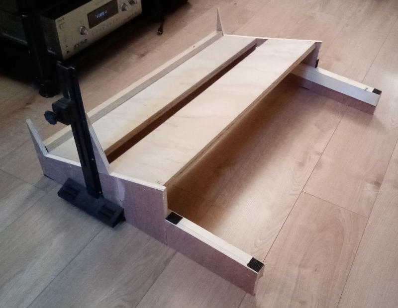


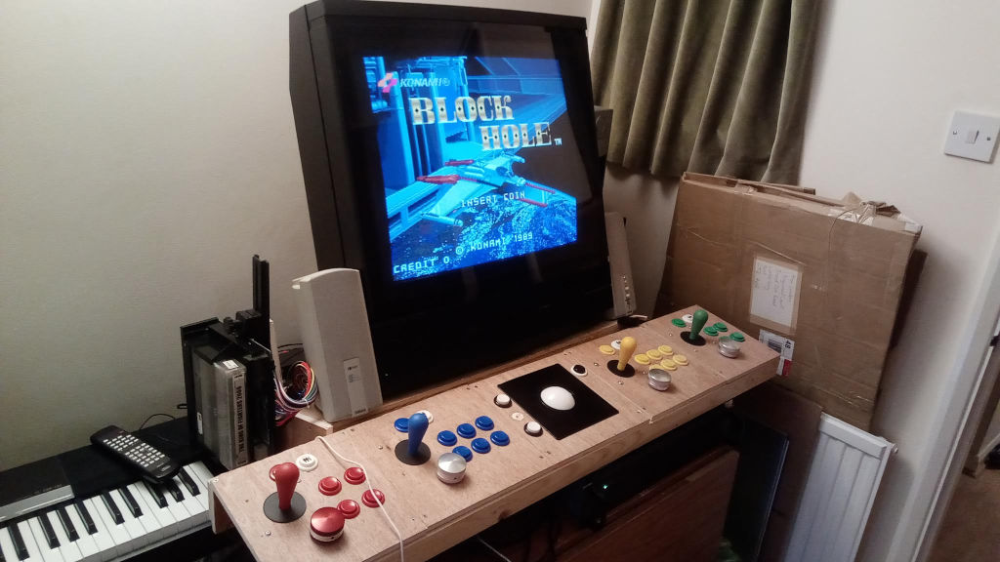

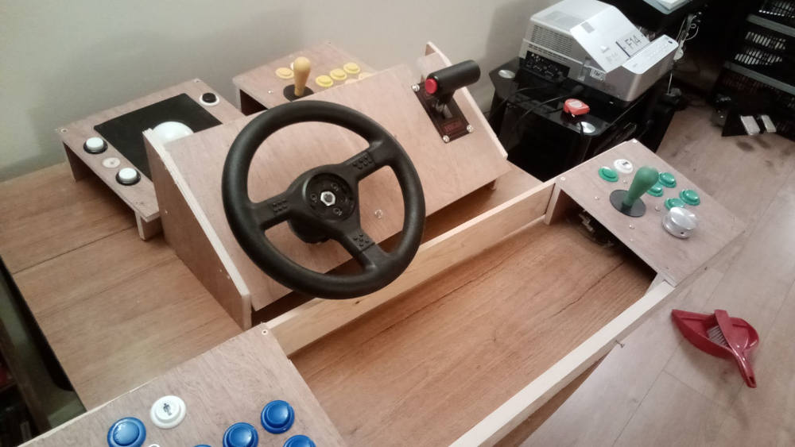

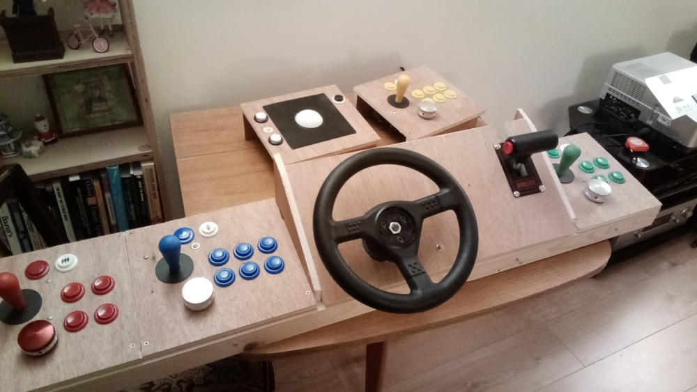

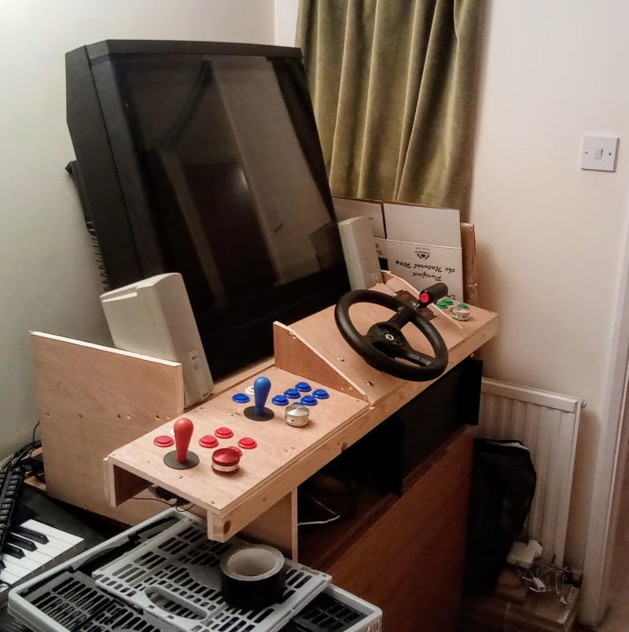

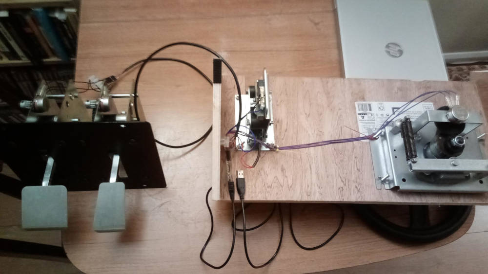

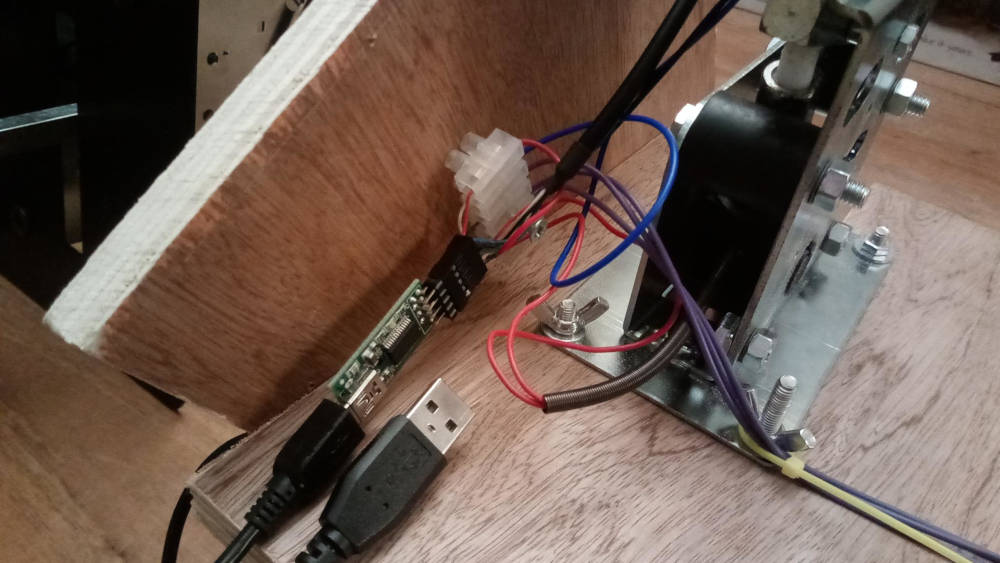

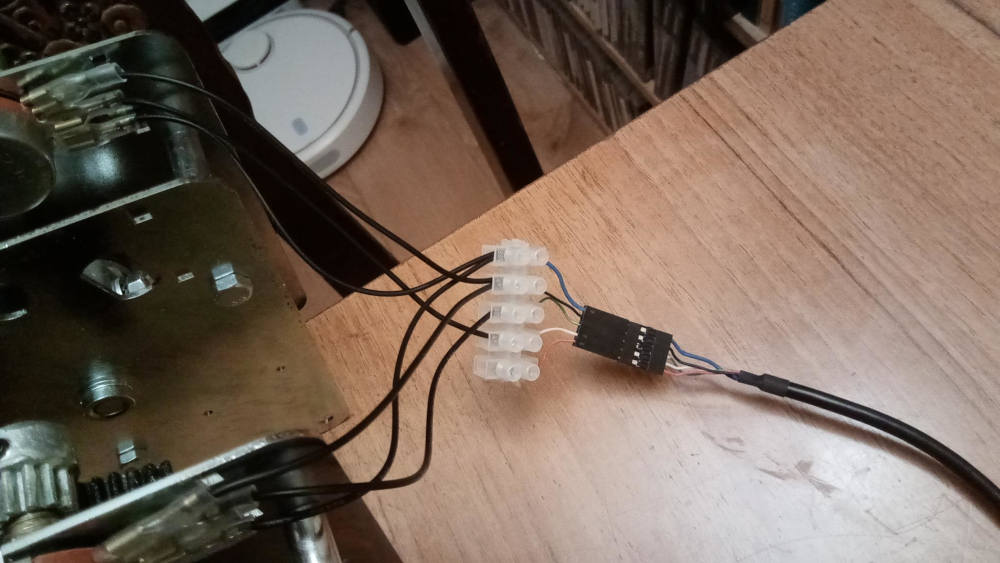

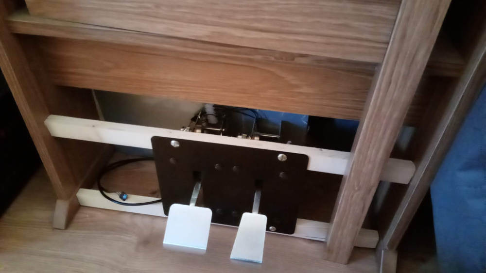

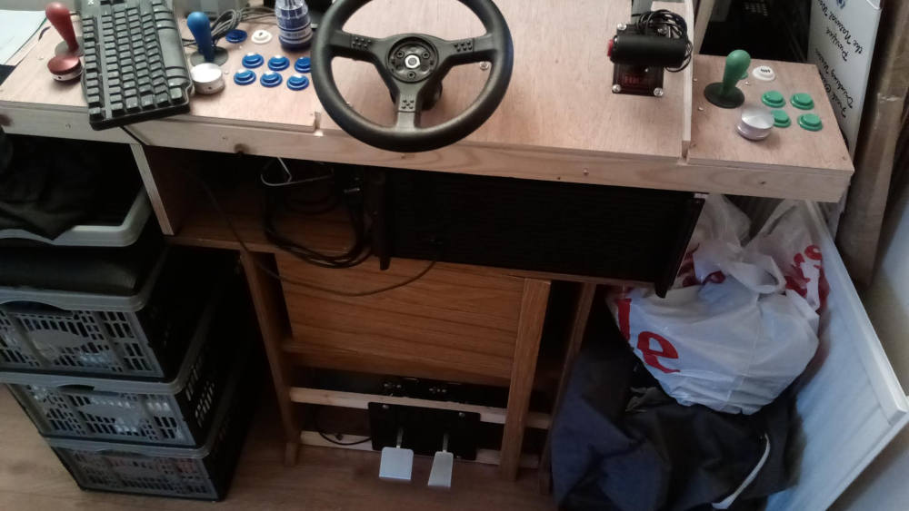


Required Tools
--------------

I deliberately wanted to avoid any soldering.

* Basic expected equipment
    * Cordless Drill/Screwdriver
    * Saw
    * Little Screwdrivers
    * Measuring tape
    * Countersync bit
    * Various drill bit sizes
* Cable ties, screws, bolts + wing-nuts (for joystick mounts)


Costs
-----

TODO: breakdown


Button layout
-------------

Physical button layout

|   |   |   |
|---|---|---|
| 1 | 3 | 5 |
| 2 | 4 | 6 |

* The first 4 buttons are the same configuration for all 4 consolers
* Neo-geo 4 button fighting games have punches and kicks on same lines as capcom fighters

Software remap button layout of players 1 and 2 to

|   |   |   |
|---|---|---|
| 1 | 2 | 3 |
| 4 | 5 | 6 |

### JPAC - Players 1 and 2

Wire kick harness for buttons 5 + 6 to supergun DB9 (see supergun pinout documentation)

### IPAC-2 - Players 3 and 4

[MacIPAC](https://evolutioninteractive.com/macipac/macipac.html) Programming tool for Ultimarc’s I-PACs

MAME defaults for Player3/Player4 + extra button 4

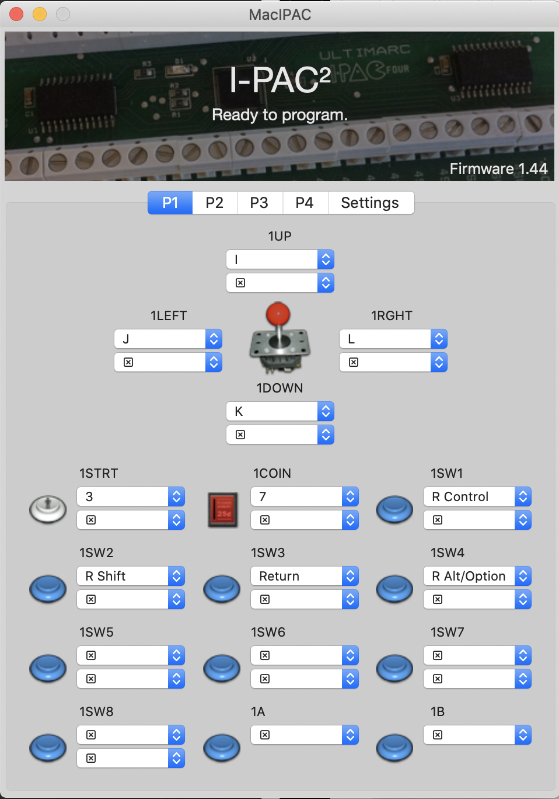

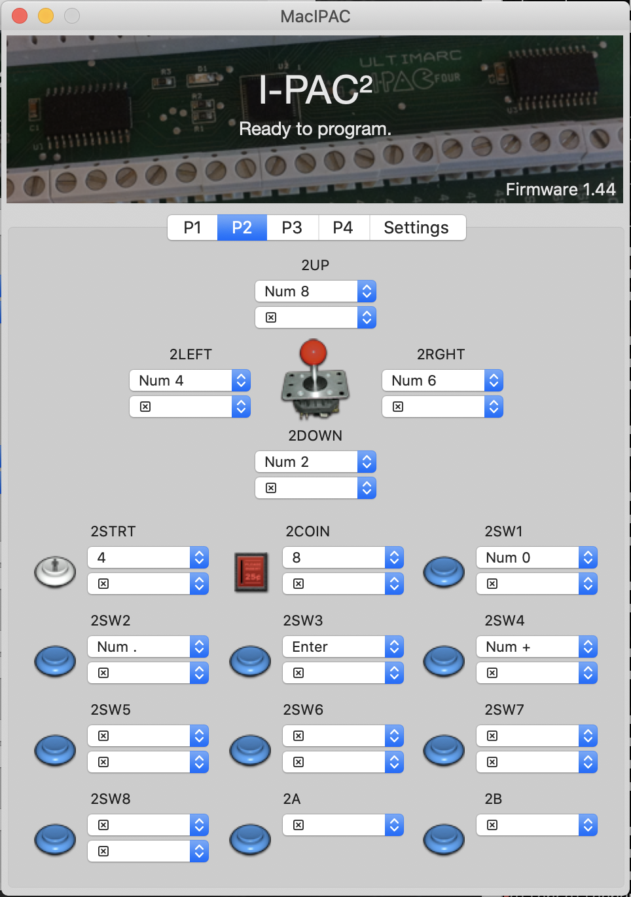


MAME Controller Mapping
-----------------------

[allan4p.cfg](./allan4p.cfg.xml)

* http://forum.arcadecontrols.com/index.php?topic=51443.0
* https://www.arcadeworlduk.com/pages/JPAC-Information.html
* http://mirrors.arcadecontrols.com/easyemu/mameguidenew/mameguide-controlini.htm
* https://docs.mamedev.org/usingmame/defaultkeys.html
* https://docs.mamedev.org/advanced/devicemap.html
* http://www.arcadeguns.com/download/MameUtility.pdf


```bash
    # install controller config file
    PATH_MAME="$(find ~/ -d -iwholename *config*/mame/)" &&\
    curl "https://raw.githubusercontent.com/calaldees/blog/master/arcadeCabinet/allan4p.cfg.xml" -o ${PATH_MAME}/ctrlr/allan4p.cfg &&\
    sed -i .  's/crtlr.*/crtlr      allan4p/g' ${PATH_MAME}/mame.ini

    # TODO
    # joystick_deadzone         0.03
    # joystick_saturation       0.95
```


Spinners
--------

* Each spinner is a mouse axis
* 2 Mice
    * Mouse 1: X-Axis = Player1
    * Mouse 1: Y-Axis = Player2
    * Mouse 2: X-Axis = Player3
    * Mouse 2: Y-Axis = Player4

### 4 Player Spinner games

Very few

spinnerShooter
* OS's only allow access to single mouse pointer


Steering Wheel
--------------

* Modular design replaces center trackball and player 2 control (see pictures)
* [SmallCab - Steering-Pedals](https://www.smallcab.net/steering-pedals-c-30_211.html)
    * [270° arcade steering wheel - potentiometer](https://www.smallcab.net/arcade-steering-wheel-potentiometer-p-1675.html)
    * [Double crankset - potentiometers](https://www.smallcab.net/double-crankset-potentiometers-p-1677.html)
    * [High/Low gearshift - Turbo](https://www.smallcab.net/highlow-gearshift-turbo-p-1679.html)
* U-HID Nano
    * 8 pins to software configure the hardware to be a 3 axis 2 button controller
        * x-axis = wheel 5v
        * y-axis = accelerator 5v
        * z-axis = break 5v
        * button 1 = gear low/high
        * button 2 = (button on shifter) [for ChaseHQ turbo]
    * 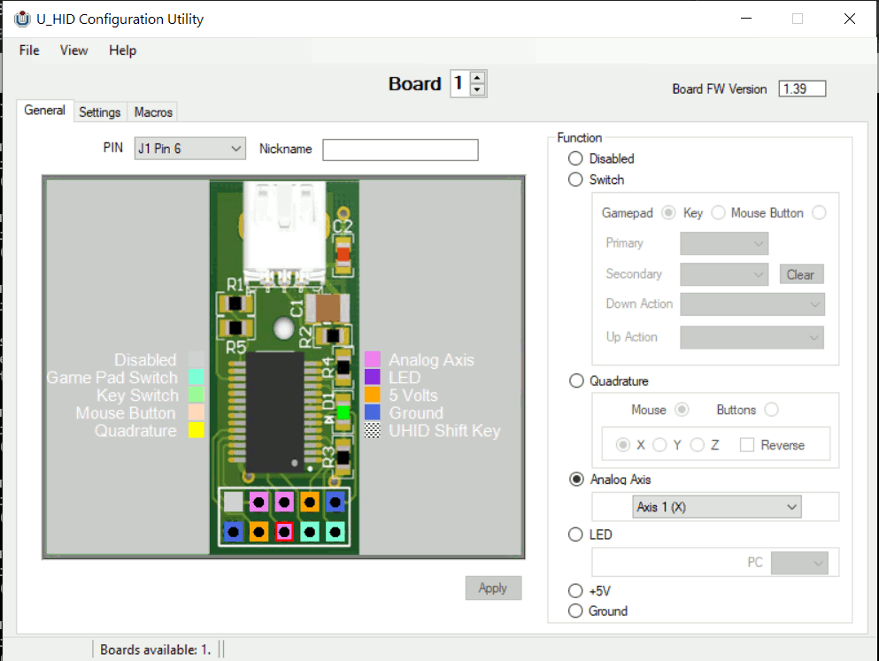
    * [UConfig_wheel.xml](./UConfig_wheel.xml)
* MAME Config
    * [Shifter Toggle Disable](https://docs.mamedev.org/advanced/shiftertoggle.html)
        * > By default, the shifter is treated as a toggle switch. One press of the mapped control for the shifter will switch it from low to high, and another will switch it back. This may not be ideal if you have access to a physical shifter that works identically to how the original machines did
        * Manual `toggle="no"` in .cfg file
    * [ArcadeControls.com - PC wheel/joystick analog settings: dead zone](http://forum.arcadecontrols.com/index.php?topic=83194.0)
        * deadzone (defaults to 0.3) - this is WAY to high
        * saturation (snap to 0% or 100%) - needs to be lowered
        * TODO: how to set this in controller.cfg?
    * [ArcadeControls.com - Topic: Hi/Lo shifter indicator in MAME!](http://forum.arcadecontrols.com/index.php?topic=97407.0)
        * Inconsistent? Can be turned off
        * TODO: more investigation needed to know if this is set-able in the controller.cfg file?


Kick Harness (for real CPS2 boards)
-----------------------------------

JAMMA only officially supports 4 buttons. Physical CPS2 boards need an additional connector for buttons 5 and 6. This is canned a _kick harness_.

The _RetroElectronik Supergun_ has a DB9 connector for kick harness. The pinout can be found in the manual

* [CPS1, CPS2 & CPS3 Connectors](https://wiki.arcadeotaku.com/w/CPS1,_CPS2_%26_CPS3_Connectors)
    * [DB9 Supergun to Arcade CPS2 and CPS3 Kick Harness Cable](https://picclick.co.uk/DB9-Supergun-to-Arcade-CPS2-and-CPS3-Kick-193024026197.html)
    * [Kick harness CPS2/CPS3 Supergun SmallCab](https://www.smallcab.net/kick-harness-cps2cps3-supergun-smallcab-p-809.html)


Voice Activation UI
-------------------

Selecting from 100,000 games with a joystick on a very low resolution screen was a pain.
All the UI's felt clumsy and needed a lot of setup.
I set about making my own voice recondition UI interface.
* [rhasspy-load-mame](https://github.com/calaldees/rhasspy-load-mame)
    * In docker container, extract game names from MAME xml and map them to rom names
    * Run rhasspy in docker container with custom `sentences.ini`
        * "PORCUPINE ... load x men children of the atom"
        * "PORCUPINE ... load desert strike on the mega drive"
    * Create mini python program to listen to rhasspy websocket intents
        * Launch MAME
        * Duck volume on activating keyword
        * `grep` game names

## Run on `rhasspy-load-mame` on GroovyArcade at startup

Tested on _GroovyArcade 2021.01_.
Set GroovyArcade to boot to LXDE as a frontend. You need to be in an existing X-session for `swtichres` to work.

```bash
    # Arch Linux Docker Tutorial
    # https://linuxhint.com/arch-linux-docker-tutorial/
    su root
    pacman -Sy docker
    systemctl start docker.service
    systemctl enable docker.service
    gpasswd -a arcade docker
```
```bash
    # Install rhasspy-load-mame
    pacman -Sy git
    pacman -Sy make
    git clone https://github.com/calaldees/rhasspy-load-mame.git
    cd rhasspy-load-mame
    make build
    make start_service
    # go to localhost:12101 or `ip address :12101` and download 100mb of packages + restart

    pacman -Sy python-pip
    pip install websockets
    make install_startup # ???
    make websocket
```

Switchres
---------

`switchres` is a tools for setting the video output to tailored low res CRT resolutions.
It runs on-top of an X-session. This is part of GroovyArcade.

https://github.com/Ansa89/switchres 1.53
https://github.com/antonioginer/switchres 2.0
https://github.com/alphanu1/switchres 2.0 (fork?)


Repairs
-------

* Retro-game Hardware
    * [Retro Games Party - Arcade Repairs](http://www.retrogamesparty.co.uk/arcade-repair-services)
* CRT
    * [Michael Maurice Repairs](http://www.michaelmauricerepairs.co.uk/) - Wembley, North London, UK
        * ledgend - recovers old tech - even rebuilds out-of-print boards from scratch!
    * [Deltavision TV Repair](https://www.deltavisiontv.co.uk/) - Birmingham, UK
    * [OHM SUPPLIES - Crt Repairs](http://www.ohmsupplies.co.uk/epages/62027733.sf/en_GB/?ObjectPath=/Shops/62027733/Categories/REPAIRS/%22CRT%20REPAIRS%22) - Liverpool
    * [ASAP electronic repair - crt monitor repair](https://asapelectronics.co.uk/services/crt-monitor-repair) - Pangborne, Reading, UK
    * Van Couriers (to pickup eBay CRT's or transport them for repair)
        * shiply.com
        * getvan.co.uk
        * anyvan.com
        * uship.com


Marque
------

* [Flip dot display](https://www.ebay.co.uk/sch/i.html?_from=R40&_trksid=p2060353.m570.l1311&_nkw=flip+dot+display&_sacat=0)?


Other references
----------------

* Arcade Parts Retailers
    * [ArcadeWorld](https://www.arcadeworlduk.com/) (UK)
    * [SmallCab.net](https://www.smallcab.net/) (France)
        * Steering wheels and CPS2 kick harness cabling
    * [R2Tronik.com](https://www.r2tronik.com/en/) (France)
        * Supergun
* Communities
    * [arcadecontrols.com](http://www.arcadecontrols.com) community of arcade cabinet builders


Unsorted Notes
==============

Audio?
https://www.arcadeworlduk.com/pages/JPAC-FAQ.html
http://forum.arcadecontrols.com/index.php/topic,39106.0.html
https://www.amazon.com/PM2038-2X5W-Stereo-Audio-Amplifier/dp/B01NABJTDJ


[Old PC and DOS games on the Sony BVM](https://imgur.com/r/crtgaming/8Q1vf)
> Dosbox SVN Daum to force games to run in a 640x200


* [7z support problem in Mame](https://forums.bannister.org/ubbthreads.php?ubb=showflat&Number=91921)
    * Some games can't be loaded directly from a 7zip file and need to be referenced by MameXML romname
