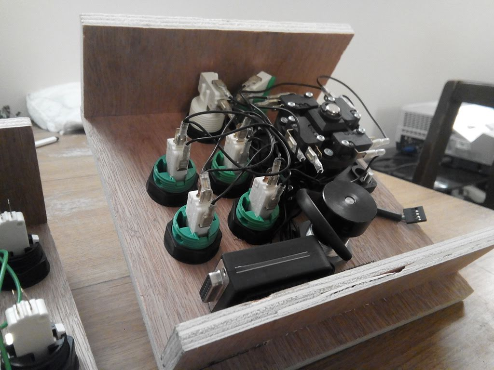
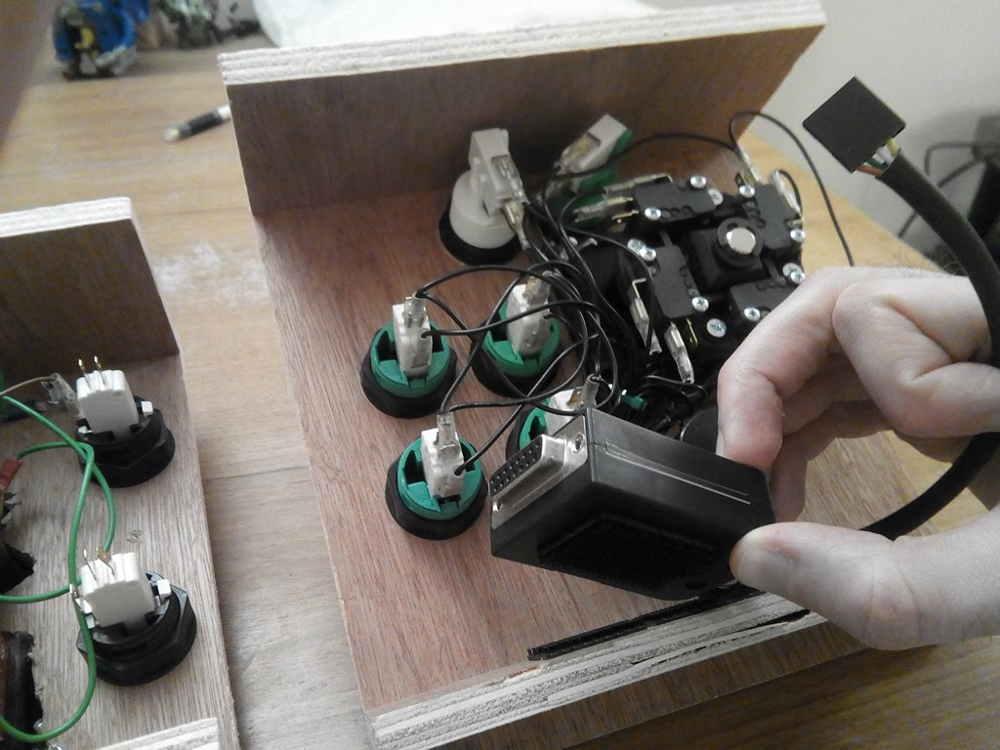
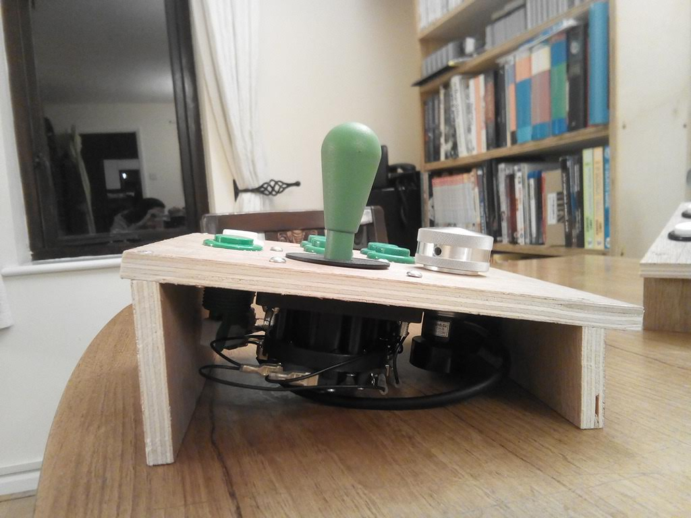
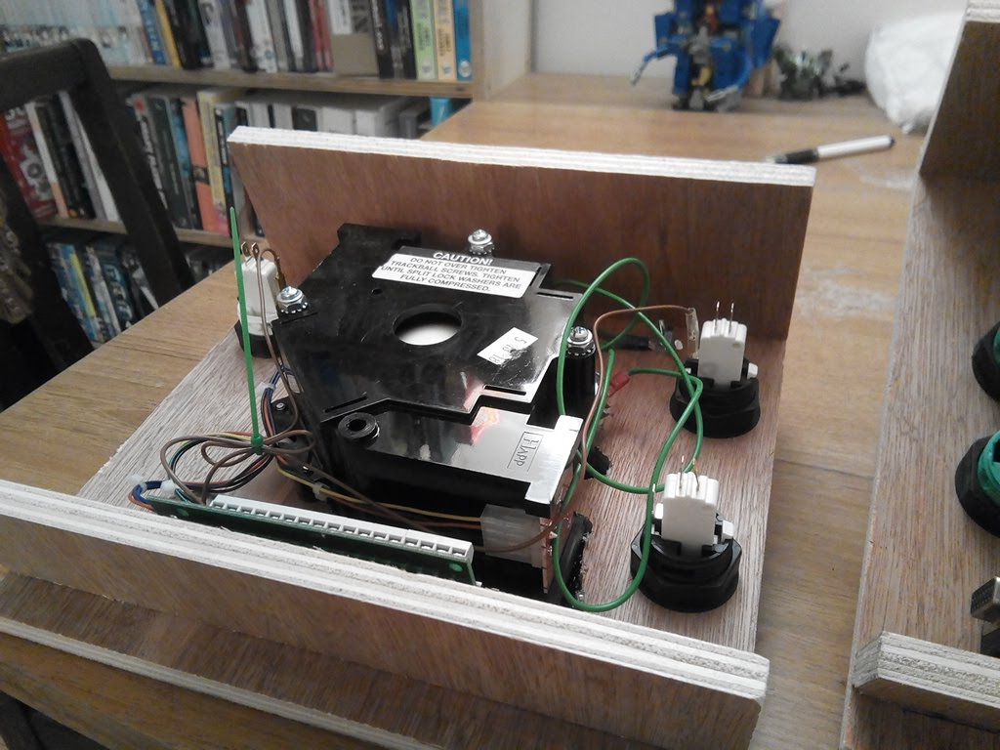
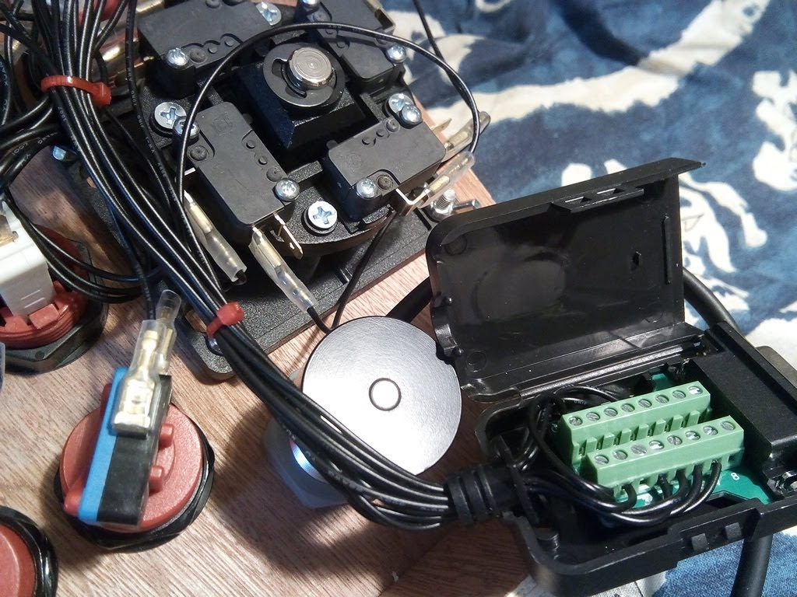
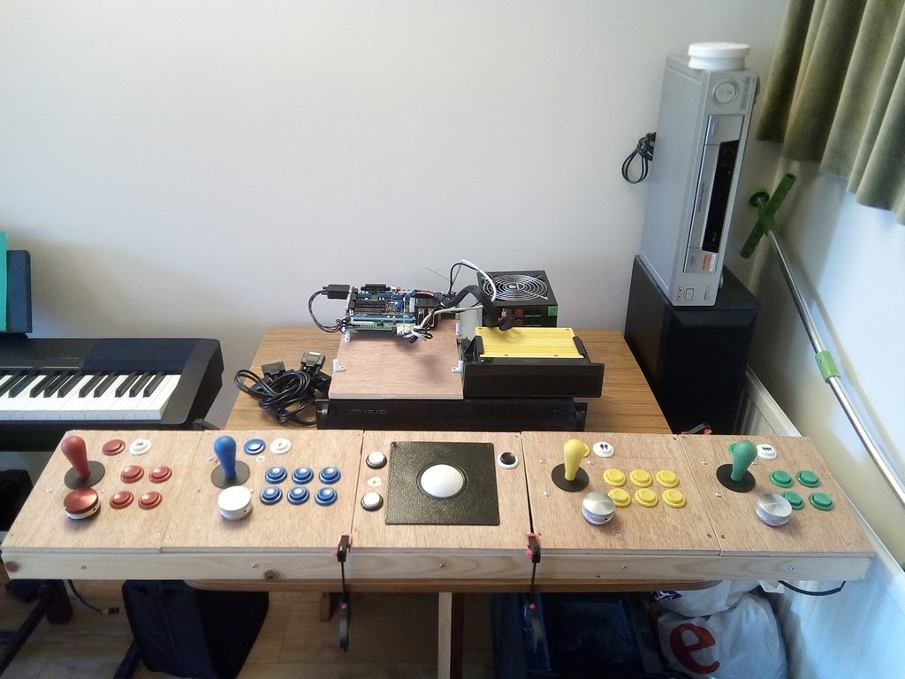
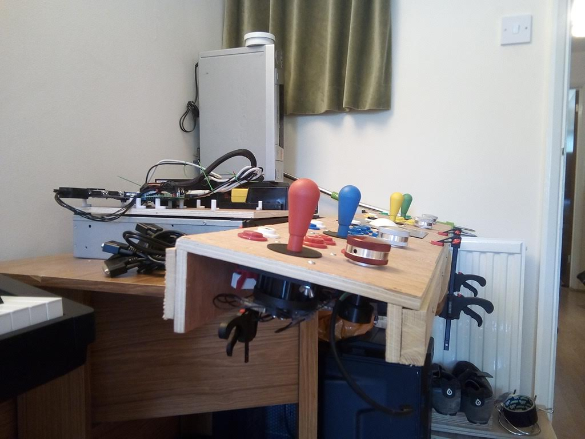
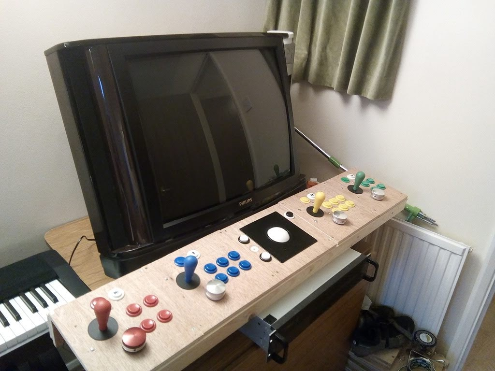
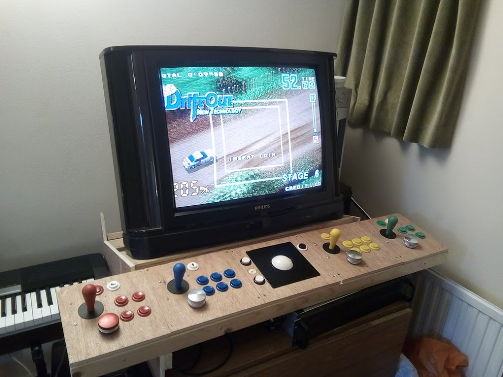

Arcade Cabinet
==============

The _Mark1_ (History)
---------------------

* A freestanding single unit with SVGA-CRT-Touchscreen hard mounted
    * Single sheets of MDF
* Created in 2005 (and lasted until 2019).
* Freeform design
    * I laid down next to the sheet of MDF and with a pen just scribbled the height of the joysticks and screen
* Pre-built [X-Arcade Dual Joystick](https://shop.xgaming.com/collections/arcade-joysticks/products/x-arcade-dual-joystick-usb-included)
* [ELO 1945C 19" CRT Touchmonitor](https://www.elotouch.com/catalog/product/view/id/1036)
* Painted with gloss and roller (looked awefull)
* Cut in half in 2011 to assist with mobility

### Use

* Took to school as a teaching aid
    * Students put in their own linux machine built themselves and touchscreen=mouse joysticks=keyboard
* Tour of friends houses
    * Too big for some of my rented accommodation; so friends borrowed it for some years at a time and passed it round

### Problems with Mark1

* Difficult to move
    * Would barely fit in a car
    * Needed 3 people to move it
    * Top heavy (screen), accident prone
* Just emulation via a PC (scaled high res display). Not overly authentic.
* Played every permutation of 2 player joystick-based 6 button game

### The Death of Mark1

Eventually the capacitors in the ELO CRT screen started to degrade and it could not hold a solid image. I attempted to repair it but the components were not user serviceable. I should have found a specialist to repair it. It was a great rare screen. I regret not servicing it.

### Conclusion

The _Mark1_ was always a prototype; There was always the plan to build (what I called in hush tones) _The UltiCab_

Proof of concept: Would an arcade cabinet be used? The answer was YES! YES! and YES!

### Photos

#### 2005: The making of

#### 2019: The dismantling

_The Mark2_ (Concept)
---------------------

* Real 15khz CRT screen
    * Authentic experience
        * [Gaming on CRT Televisions, PVMs and BVMs :: RGB104 / MY LIFE IN GAMING](https://youtu.be/RAi8AVj9GV8)
* [JAMMA Edge Connector](https://en.wikipedia.org/wiki/Japan_Amusement_Machine_and_Marketing_Association#Connector_standards)
    > The JAMMA standard uses a 56-pin edge connector on the board with inputs and outputs common to most video games. These include power inputs (5 volts for the game and 12 volts for sound); inputs for two joysticks, each with three action buttons and one start button; analog RGB video output with negative composite sync; single-speaker sound output; and inputs for coin, service, test, and tilt.
    * Facilitate
        * the use real JAMMA Arcade Boards
        * or an Emulated machine
* 4 Players
    * more players == more social
* Spinners + Trackball
    * Interesting control methods that can't be reproduced with a common joypads
* Modular design; To facilitate
    * Move with a normal car
    * Slimming down to 2 players (if 4 players too big for the next house)
    * Have individual components repaired or replaced
        * If the screen dies again or a controller gets damaged
    * Screen could easily be rotated for vertical 3:4 games
    * Quick to dismantle if needed (15min?)
* Simple as possible to build
    * Avoid specialist rare high value components (screen)
    * No soldering or electronics knowledge
    * No advanced software skills
    * Only basic tools required
        * just a saw, drill and screws
* Cheap (£100's not £1000's)
    * Normal Plywood
    * Normal CRT TV
    * Normal Furniture (base)
    * Normal Tools

Components
----------

* Real JAMMA Boards (Optional)
    * eBay [Coin Operated Arcade Games Cartridges](https://www.ebay.co.uk/b/Coin-Operated-Arcade-Games-Cartridges/171921/bn_16567451)
    * Cheap entrylevel
        * eBay [neo geo mvs 1 slot](https://www.ebay.co.uk/sch/i.html?_from=R40&_trksid=m570.l1313&_nkw=neo+geo+mvs+1+slot&_sacat=171921&LH_TitleDesc=0&_osacat=171921&_odkw=neo+geo+mvs)
        * Multi-game cartridge (like a pre loaded flash cartridge with 160+ neo-geo games)
    * No latency from emulation
* Emulated system
    * Low spec PC (chosen solution)
        * 2.xGhz, 4GB RAM, 1TB Storage
        * Low Profile ATX Case (1u rack?)
        * [ATI Radeon HD 5450](https://www.ebay.co.uk/sch/i.html?_nkw=Radeon+HD+5450) - Modifiable for driving 15khz CRT display
            * [A guide to connecting your Windows PC to an SD CRT TV, PVM or Arcade Monitor](https://www.aussiearcade.com/forum/arcade/m-a-m-e-emulation-projects-and-discussion/89704-a-guide-to-connecting-your-windows-pc-to-an-sd-crt-tv-pvm-or-arcade-monitor?viewfull=1)
        * [GroovyArcade live-CD](http://forum.arcadecontrols.com/index.php?board=52.0)
            * Arch linux with hacked Radeon drivers for CGA CRT output
    * Raspberry Pi (possible alternate solution)
        * [pi2scart and pi2jamma](http://pi2jamma.info/)
            * from [ArcadeForge](http://arcadeforge.net/Pi2Jamma-Pi2SCART/PI2SCART::264.html)
    * All-in-one Emulated off the shelf JAMMA board (possible alternate solution)
        * [Game Elf](https://www.google.com/search?q=game+elf+JAMMA)
        * [Pandoas Box](https://www.google.com/search?q=pandora%27s+box+JAMMA)
* Input - 4 player controls
    * Housing
        * Simple Custom Modular Plywood Controls (chosen solution)
            * One sheet of 12mm Ply (610mm x 1220mm)
            * Tools
                * Circular Saw (with ability to set rough angle of 10deg?)
                * 30mm Flat Bit Wood Drill (for buttons and joystick holes)
            * 3 cuts with circular saw (create a wood jig to cut straight along the 1220mm edge)
                * 8cm |(10deg)| 5cm | 23cm
            * Separate interchangeable joystick/trackball controls
                * Each controller is an independent Neo-Geo pad (DB15 connector)
                * Can be bolted/screwed together to be reconfigured
        * Pre-cut (possible alternate solution)
            * [Bitcade - 4 Player Control Panel Kit](https://bitcade.co.uk/products/bitcade-4-player-control-panel-kit?variant=6546959761435)
    * Control Components (from [Arcade World UK](https://www.arcadeworlduk.com/))
        * Joysticks
        * Arcade Buttons (SuzuHapp Ultimate)
        * SuzuHapp 3inc TrackBall + Metal Surface Plate
        * SpinTrak Rotary Control
            * Flyweight
            * Spinner Tops
        * Pre Crimped Insulated Wire
        * Daisy Chain Harness Wires (for ground)
    * Control Interfaces by [Ultramarc](https://www.ultimarc.com/) (Available form arcadeworlduk.com)
        * [J-Pac](https://www.ultimarc.com/control-interfaces/j-pac-en/) Interface a PC as a JAMMA arcade board
            * Two joystick inputs (as USB Keyboard)
            * VGA output
        * [Opti-Pac](https://www.ultimarc.com/control-interfaces/opti-pac/) Optical encoder
            * Trackball and Spinners (as USB Mouse)
        * [I-Pac-2](https://www.ultimarc.com/control-interfaces/i-pacs/i-pac2/) Keyboard encoder
            * Two joystick inputs (as USB Keyboard)
                * For players 3 and 4
                * Also has 2 spinner inputs if needed
    * Cables
        * DB15 Solderless - Female (for neo-geo pad output)
        * DB15 Extender (1m)
* Output
    * PAL CRT TV SCART 4:3 (20inc+)
        * [eBay](https://www.ebay.co.uk/sch/i.html?_dcat=11071&_fsrp=1&Screen%2520Size=20%252D29%2520in&_nkw=TV&rt=nc&Display%2520Technology=CRT)
        * Real arcade screens are expensive, difficult to maintain, difficult to setup
            * Tube is separate from electronics and requires a separate harness/frame
        * The same technology is in a PAL TV; pre packaged, cheaper, more readily available
        * PAL TV's can be driven at 60hz with RGB+Sync. NTSC TV's (america) have a harder time with this
    * Speakers and amp
        * Normal TV's have poor builtin audio
* JAMMA Interface (for PAL SCART TV + Controls + Power)
    * [RetroElectronik Supergun ProGamer Arcade JAMMA](https://www.r2tronik.com/en/supergun/145-supergun-progamer-arcade-jamma-autofirevoltmeter-included-0715235390870.html)
        * [Retroelectronik Supergun Pro GamerUser Manual](http://www.r2tronik.com/soft/progamer_en.pdf)
    * ATX power supply (Required to power JAMMA arcade board)
    * L Type Mounting Plastic PCB Feet with Screw for Arcade JAMMA
* Cabinet
    * Base (Normal Table or Dresser)
        * Controls + Screen can be placed on a normal table or waist-high dresser/draws
        * The heavier/stable the base the better (4 people pushing and pulling will make it jostle)
    * Custom Simple Screen Stand (to fit over electronics)
        * One sheet of 12mm Ply (610mm x 1220mm)
            * TODO: Diagram of cuts + angle
            * 39cm
            * 11cm
        * Shelf to angle the screen - put custom wood brace at back for your TV footprint
            * 80cm wide shelf
        * Arms for mounting controls
    * Recommend fixing controls and screen to base (screws? duel-lock?)
        * [3M Dual Lock](https://www.amazon.co.uk/3M-SJ354B-Reclosable-Fastener-Black/dp/B07798C527/)

Making of Mark2
---------------

Required Tools
--------------

* Basic expected equipment
    * Cordless Drill/Screwdriver
    * Saw
    * Little Screwdrivers
    * Measuring tape
    * Countersync bit
    * Various drill bit sizes
* Cable ties, Screws, Nuts+Wingnuts (for joystick mounts)

Spinners
--------

* Each spinner is a mouse axis
* 2 Mice
    * Mouse 1: X-Axis = Player1
    * Mouse 1: Y-Axis = Player2
    * Mouse 2: X-Axis = Player3
    * Mouse 2: Y-Axis = Player4

### 4 Player Spinner games

Very few

spinnerShooter
* OS's only allow access to single mouse pointer

Other references
----------------

* [arcadecontrols.com](http://www.arcadecontrols.com) community of arcade cabinet builders
