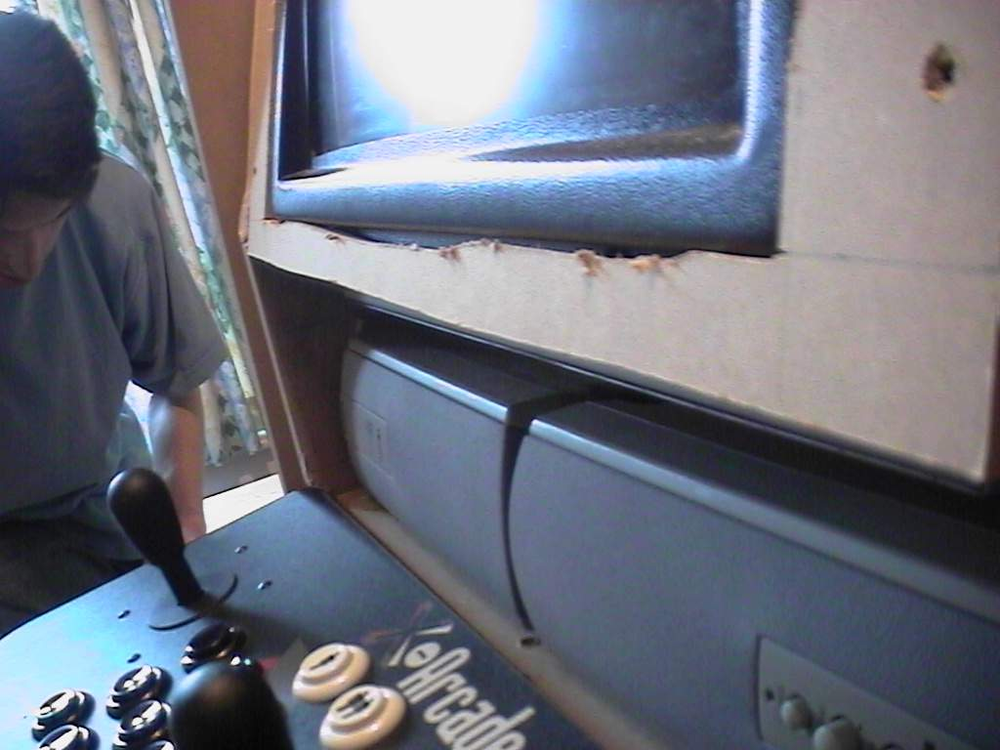
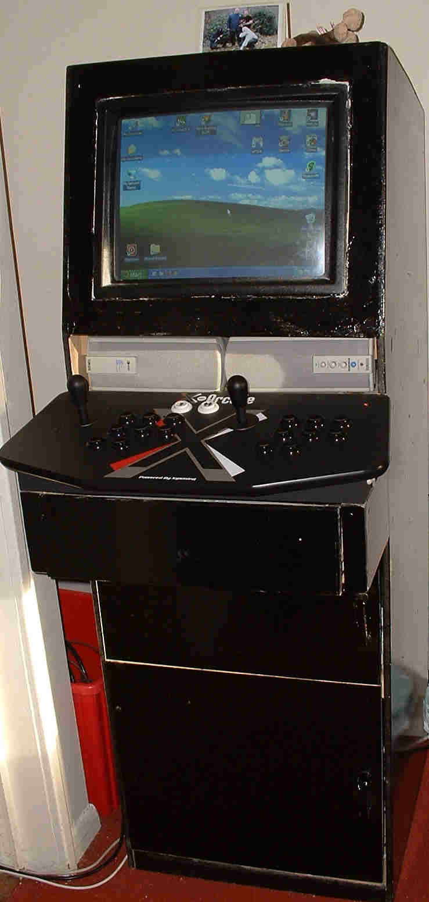

Arcade Cabinet
==============

History (The _MarkI_)
---------------------

The _MarkI_
* Freestanding single unit with SVGA-CRT-Touchscreen hard mounted
    * Single sheets of MDF
* Created in 2005 (and lated until 2019).
* Freeform design
    * I laid down next to the sheet of mdf and with a pen just scribbled the height of the joysticks and screen
* Pre-built [X-Arcade Dual Joystick](https://shop.xgaming.com/collections/arcade-joysticks/products/x-arcade-dual-joystick-usb-included)
* [ELO 1945C 19" CRT Touchmonitor](https://www.elotouch.com/catalog/product/view/id/1036)
* Painted with gloss and roller (looked awefull)
* Cut in half in 2011 to assist with mobility

### 2005

### 2019

### Use

* Took to school as a teaching aid
    * Put in linux machine built themselves and touchscreen=mouse joysticks=keyboard
* Tour of friends houses
    * It was huge; friends borrowed it for a year a time and passed it round.

### Problems

* Difficult to move
* Played every permutation of 2 player joystick-based 6 button game
* Just emulation via a PC

The was always a prototype; There was always the plan to build (what I termed) _The UltiCab_
The test was: Would an arcade cab be used? The answer was YES! YES! and YES!

### The Death

Eventually the capacitors in the ELO CRT screen started to degrade and it could not hold a solid image. I attempted to repair it but the components were not user serviceable. I should have found a specialist to repair it. It was a great rare screen. I regret not servicing it.

Concept (for _The MarkII_)
--------------------------

* Real 15khz CRT screen
* Use real JAMMA Boards or Emulation
* Use of emulated machine to drive 15khz and JAMMA controls
* 4 players
* Spinners + Trackball
* Modular design; To facilitate
    * Moving
    * Slimming down (if 4 players too big)
    * Have individual components repaired or replaced
        * If the screen dies again or a controller gets damaged
* Simple as possible to build and setup

Components
----------

* Emulated system
    * Low spec PC
        * 2.xGhz, 4GB RAM, 1TB Storage
        * Low Profile ATX Case (1u rack?)
        * Radeon HD 5450 - Modifiable for driving 15khz CRT display
            * [A guide to connecting your Windows PC to an SD CRT TV, PVM or Arcade Monitor](https://www.aussiearcade.com/forum/arcade/m-a-m-e-emulation-projects-and-discussion/89704-a-guide-to-connecting-your-windows-pc-to-an-sd-crt-tv-pvm-or-arcade-monitor?viewfull=1)
        * [GroovyArcade live-CD](http://forum.arcadecontrols.com/index.php?board=52.0)
            * Mame ROMs, CHD's and MediaMedia
    * Raspberry Pi
        * [pi2scart and pi2jamma](http://pi2jamma.info/)
            * from [ArcadeForge](http://arcadeforge.net/Pi2Jamma-Pi2SCART/PI2SCART::264.html)
* Input - 4 player controls
    * Options
        * Custom
            * 12mm Ply (610mm x 1220mm)
            * 3 cuts with circular saw
                * Circular Saw (with ability to set rough angle)
                * 30mm Flat Bit Wood Drill
        * Pre-cut
            * [Bitcade - 4 Player Control Panel Kit](https://bitcade.co.uk/products/bitcade-4-player-control-panel-kit?variant=6546959761435)
    * Components from [Arcade World UK](https://www.arcadeworlduk.com/)
        * Joysticks
        * Arcade Buttons (SuzuHapp Ultimate)
        * TrackBall + Metal Surface Plate
        * SpinTrak Rotary Control
            * Flyweight
            * Spinner Tops
        * Insulated Crimped Wire
        * Daisy Chain Harness Wires (for ground)
    * Control Interfaces by [Ultramarc](https://www.ultimarc.com/) (Available form arcadeworlduk.com)
        * [J-Pac](https://www.ultimarc.com/control-interfaces/j-pac-en/)
            * Interface a PC as a JAMMA arcade board
            * Two joystick inputs (USB Keyboard)
            * VGA output
        * [Opti-Pac](https://www.ultimarc.com/control-interfaces/opti-pac/)
            * USB Optical interface (for trackball and spinners)
        * [I-Pac-2](https://www.ultimarc.com/control-interfaces/i-pacs/i-pac2/)
            * Two joystick inputs (USB Keyboard)
                * For players 3 and 4
                * Also has 2 spinner inputs if needed
    * Cables (eBay)
        * DB15 Solderless (for neo-geo pad output)
        * DB15 Extender (1m)
* Output
    * PAL CRT TV SCART 4:3 (20inc+)
    * Speakers and amp
* JAMMA interface
    * [RetroElectronik Supergun ProGamer Arcade Jamma](https://www.r2tronik.com/en/supergun/145-supergun-progamer-arcade-jamma-autofirevoltmeter-included-0715235390870.html)
        * [Retroelectronik Supergun Pro GamerUser Manual](http://www.r2tronik.com/soft/progamer_en.pdf)
    * ATX power supply
    * L Type Mounting Plastic PCB Feet with Screw for Arcade JAMMA

Making of MarkII
----------------

Required Tools
--------------

* Basic expected equipment
    * Cordless Drill/Screwdriver
    * Saw
    * Little Screwdrivers
    * Measuring tape
    * Countersync bit
    * Various drill bit sizes
* Cable ties, Screws, Nuts+Wingnuts (for joystick mounts)

Spinners
--------

* Each spinner is an axis
* 2 Mice
    * Mouse 1: X-Axis = Player1
    * Mouse 1: Y-Axis = Player2
    * Mouse 2: X-Axis = Player3
    * Mouse 2: Y-Axis = Player4

### 4 Player Spinner games

Very few

spinnerShooter
* OS's only allow access to single mouse pointer

