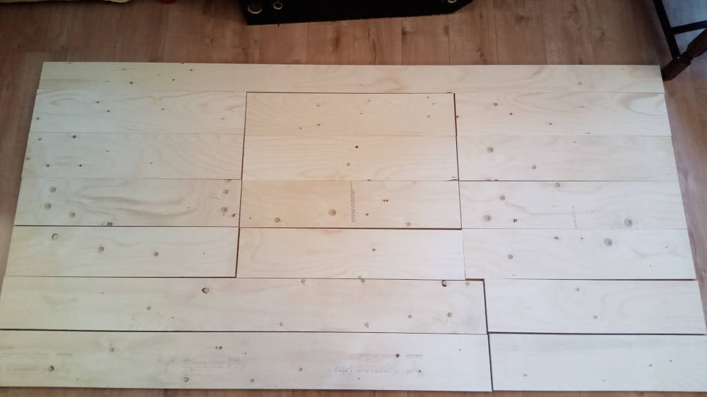
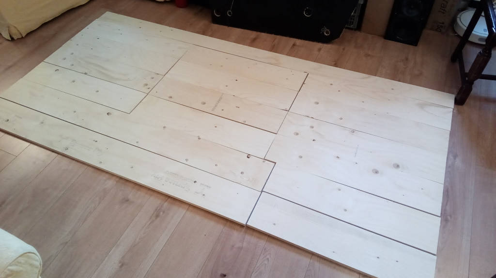
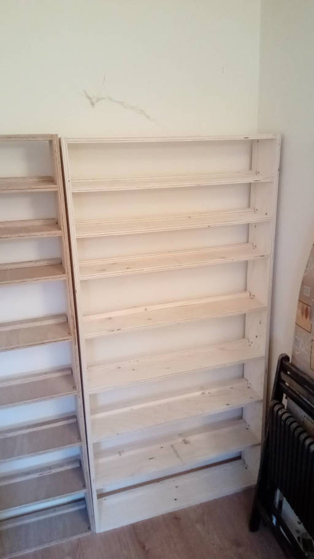
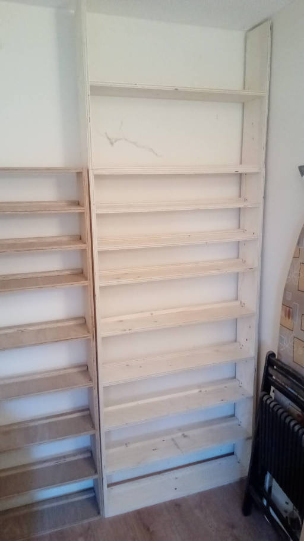
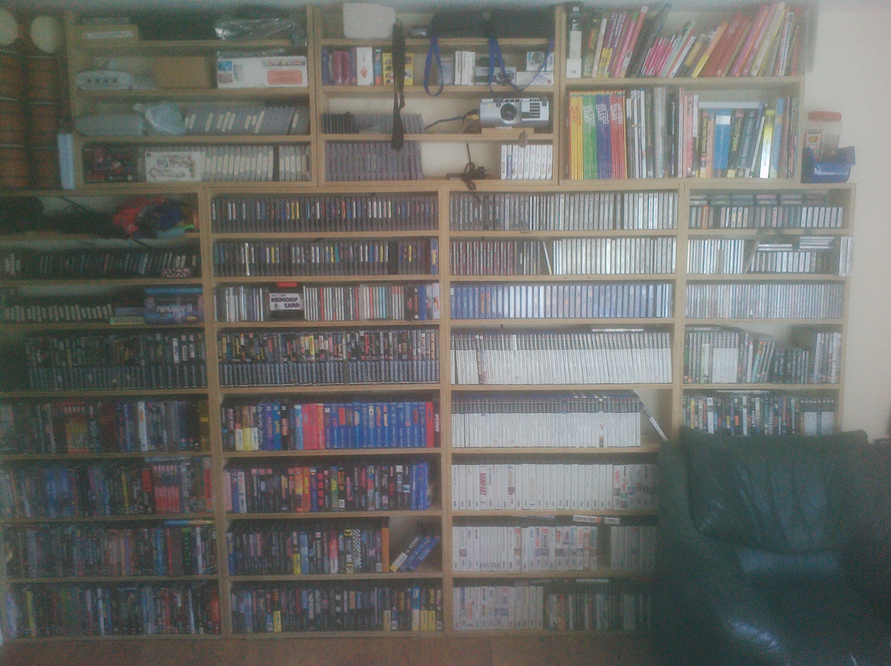

Shelves
-------

Modular, ceiling high shelves for CD, DVD and book storage.
Made from a single sheet of standard size ply from most DIY shops for £40.

2.44m * 1.22m * 18mm = £38 Natural Softwood Plyboard

Get shop to cut it into 18cm planks
122cm / 18cm = 6.77
18cm was the smallest B&Q's machines could cut the shelves.

Sides = 170cm * 18cm
Shelves = 81cm * 18cm

2 (top/bottom) + 7 shevles = 9
(8 useable shelfs: 3 cd height 14cm useable, 5 dvd height 22cm useable)

One main unit + top unit =

|81|81|81| * 1 (top shelves)
|81|81|81| * 3 (main shelves)
|170|74(cut to 61 for top)| * 2

Ver 2: suggestion
-----------------

20cm deep shelves (maybe that's slightly to deep for DVD's)
|81|81|81| * 4 (main shelves)
|162|81(cut to 61 for top)| * 2

Buy some cheap light battoning for the backstops
