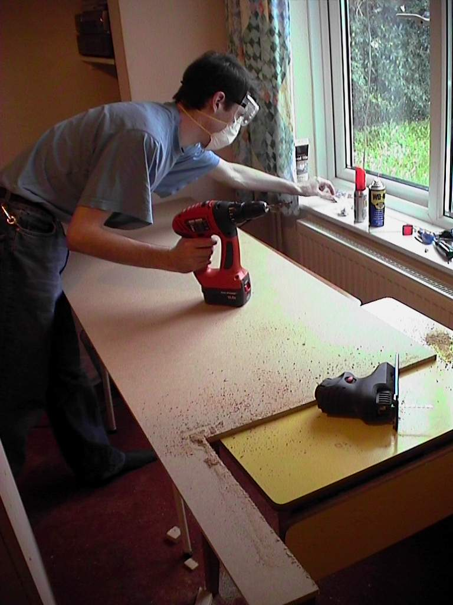
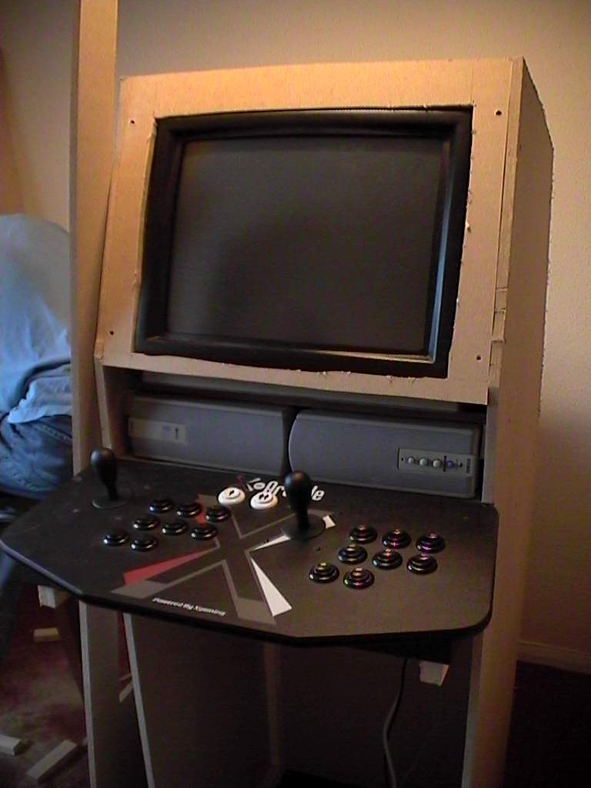
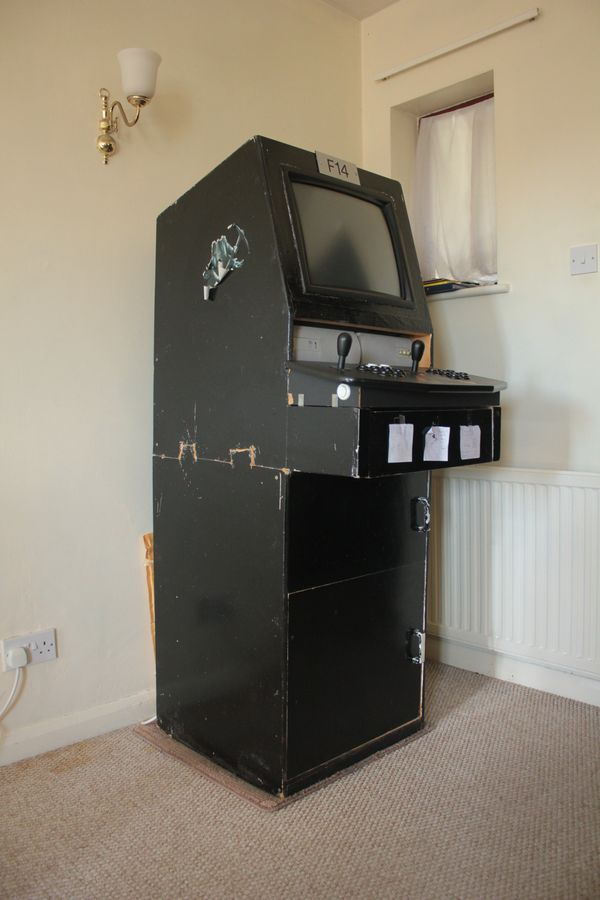
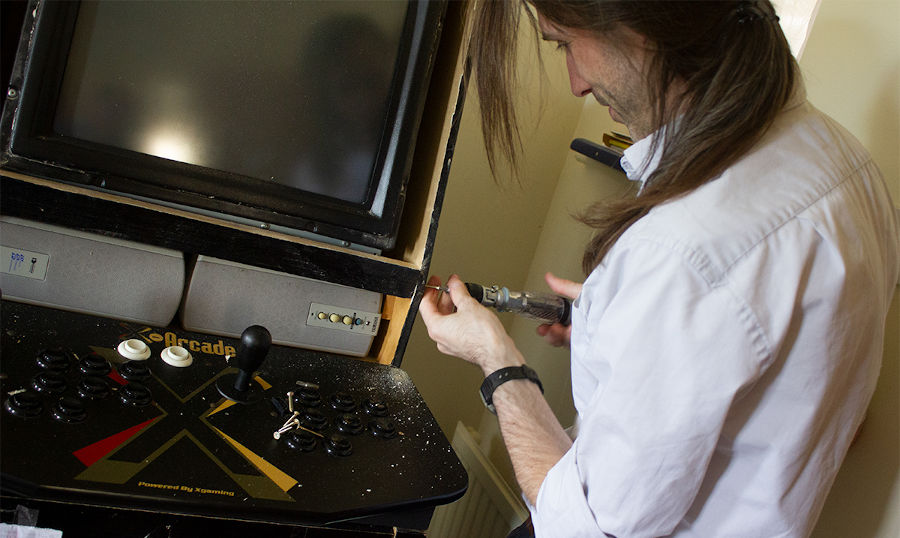
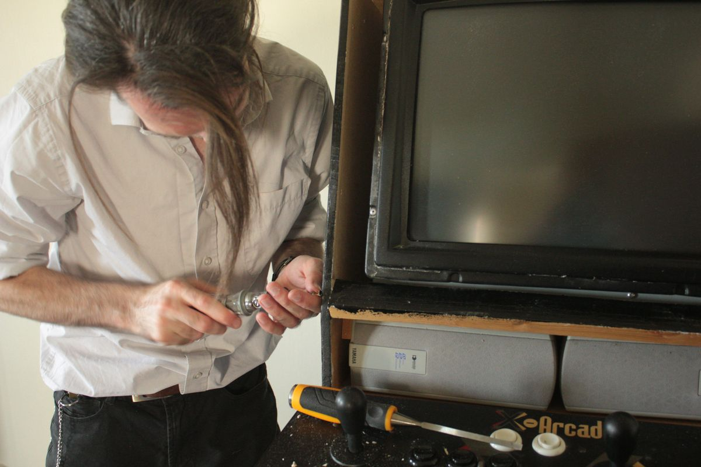
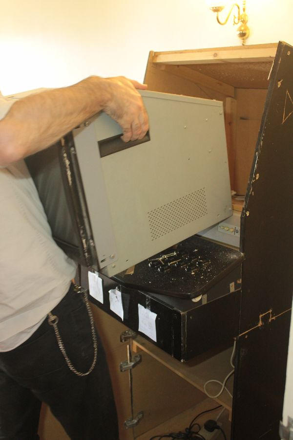

The _Mark1_ (History)
---------------------

* A freestanding single unit with SVGA-CRT-Touchscreen hard mounted
    * Single sheets of MDF
* Created in 2005 (and lasted until 2019).
* Freeform design
    * I laid down next to the sheet of MDF and with a pen just scribbled the height of the joysticks and screen
* Pre-built [X-Arcade Dual Joystick](https://shop.xgaming.com/collections/arcade-joysticks/products/x-arcade-dual-joystick-usb-included)
* [ELO 1945C 19" CRT Touchmonitor](https://www.elotouch.com/catalog/product/view/id/1036)
* Painted with gloss and roller (looked awefull)
* Cut in half in 2011 to assist with mobility

### Use

* Took to school as a teaching aid
    * Students put in their own linux machine built themselves and touchscreen=mouse joysticks=keyboard
* Tour of friends houses
    * Too big for some of my rented accommodation; so friends borrowed it for some years at a time and passed it round

### Problems with Mark1

* Difficult to move
    * Would barely fit in a car
    * Needed 3 people to move it
    * Top heavy (screen), accident prone
* Just emulation via a PC (scaled high res display). Not overly authentic.
* Played every permutation of 2 player joystick-based 6 button game

### The Death of Mark1

Eventually the capacitors in the ELO CRT screen started to degrade and it could not hold a solid image. I attempted to repair it but the components were not user serviceable. I should have found a specialist to repair it. It was a great rare screen. I regret not servicing it.

### Conclusion

The _Mark1_ was always a prototype; There was always the plan to build (what I called in hush tones) _The UltiCab_

Proof of concept: Would an arcade cabinet be used? The answer was YES! YES! and YES!

### Photos

#### 2005: The making of

#### 2019: The dismantling

