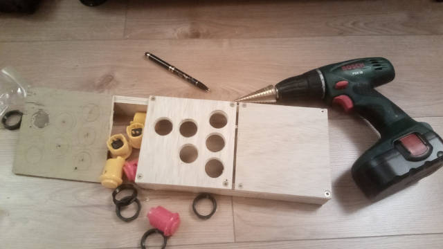
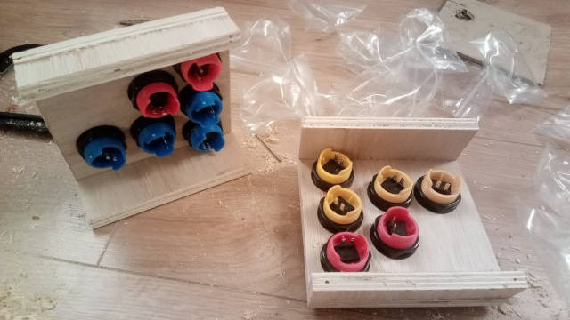

Joystick Replacement
====================

Problem
-------

Amiga, ST, Spectrum, C64, Amstrad, Atari 2600
All have single button joysticks.
9pin standard

Many platform games used `up` as a jump mechanic
Turrican
Rainbow islands

Up as jump is an awful control pattern. When walking left and right you randomly jump. Randomly taking corners in driving games flicks up and down gears. The time to recover to perform the up/down operation again is significant

Other games like 
Lotus 3 use up down for gears
Supercars 2 use up down for weapons

Up and Down need to discreet buttons separate from left and right

I was weaned on PC games without a joystick. The greatest weapon was z,x o,k? space

On a pad, switching between left and right has an overhead.
It is possible with discreet buttons to switch between left and right quicker

Sadly many Amiga games simply do not allow the configuration of keyboard keys and _require a joystick_


Solution
--------

Custom arcade button controller that replaces single button 9pin joystick


Buttons 3cm? diameter
13.5cm by 13.5cm

```python
>>> import math
>>> math.asin((5-3)/13.5) * (180/math.pi)
8.519624254143045
```
10deg will do

cuts
3cm /(8.5deg)/ 5cm | 13.5cm

Construction
------------








