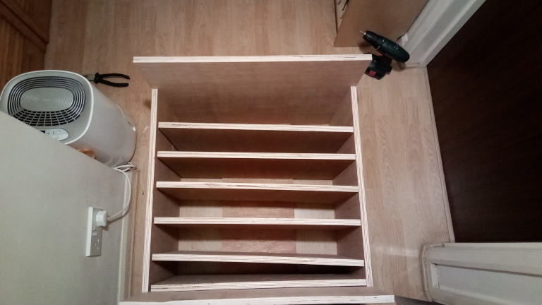

Computer Shelves
================

Thinking
--------

61(width)x40(depth)
9cm between shelves

* Computers
    * spectrum
    * amstrad cpc
    * c64
    * atari st
    * amiga
    * bbc

(5 * (9.68 + 1.8)) + (2 * 1.8) = 57.6

Comparison height
 75 is a table
 51 to 54 is a tv stand or arm of sofa

If I built it TV stand height - then I put items on top of it.
If I want to extend it vertically I can with another set of shelves the same dimensions

### Final Unit dimensions
Width 61 + (2*2) = 65
Height 61 + (2*2) = 65
Depth 42 + (1.8 door + 0.2 gap) = 44

Useable height = 61
61/6 = 10.16 per shelf = 10.16 - 1.8 = 8.36 per shelf? is that enough?

### How to cut

2.44m * 1.22m * 18mm = £38 Natural Softwood Plyboard or £40 Hardwood Plyboard

* 61
    * ((42*2) + (65)*2 ) + 30(ish leftover) = 244
    * (2 sides) + top/bottom (cut to 42 manually) + vertical-back-brace
* 61
    * (40*6) + 4(ish leftover) = 240
    * 6 shelves

The overhang from the 65cm can be cut for shelve runners

Not a cm of the ply sheet is wasted! - will need separate doors though

### Power and SCART

* All computers connect via standard SCART RGB with cables from [retrocomputershack.com](https://www.retrocomputershack.com/)
* SCART Coupler for each shelf
    * female to female
* IEC power C14 to UK Plug for each shelf
