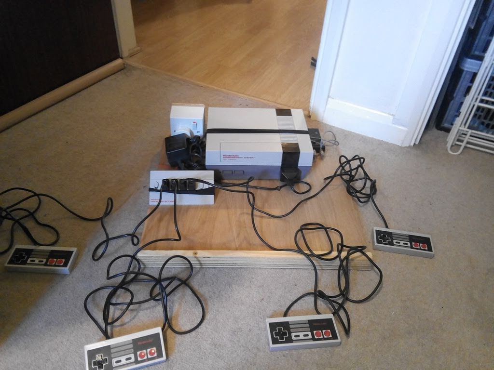
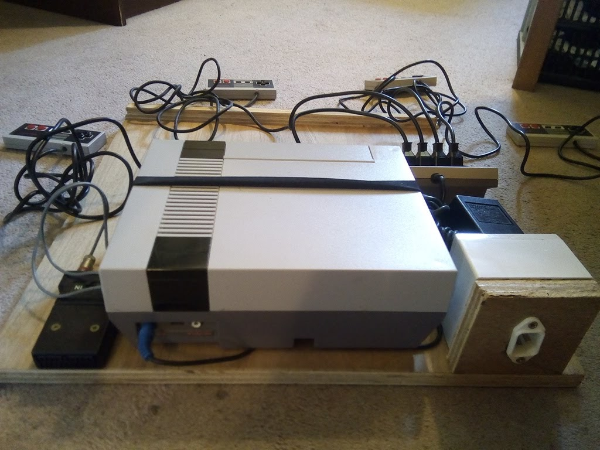

Console Shelf's
===============

A functional solution to making my console collection useable and accessible.

Problem
-------

* I have a reasonable collection of video-game consoles
* I wanted the collection to be useable
* Each console had their own power adaptor (sometimes multiple) and controllers

* It was
    * time consuming to switch machines
    * the consoles were becoming damaged with repeated plugging and unplugging

Solution
--------

* Each console had it's own removable shelf
* Each shelf had
    * a standard 3pin IEC power connector
    * a standard SCART connection
* Each shelf had a lip for
    * grip
    * stop pads casually sliding out
* The consoles were loosely attached to the shelf
    * Elastic
    * Cable tacks
* The shelfs were housed in a custom cupboard/rack with a door (to prevent dust buildup

Use
---

The party trick.
* I had the games for 17 systems visible on custom highted bookshelf's (floor to ceiling)
* I would ask guests to select a game they remember
* After a few minuets a game would be selected
* 30 seconds
    * Pull the console shelf out
    * Plug it into the loose IEC and SCART cables by the TV
    * put the game in
    * press the power button
    * hand a controller to the guest
* Largely guest kind of just stood there and didn't necessarily want to play the game
* at which point
* 30 seconds
    * turn the console off
    * put the pad back on the shelf
    * slide the console shelf away
    * put the game away

Measurements
------------

196(height)x48(depth)x52(front)

48x48 shelf + 10cm clearance between each. Some need more (32x and gamecube)

Small brace is used for the middle (TODO photos)

